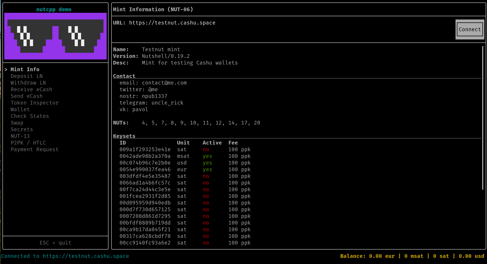
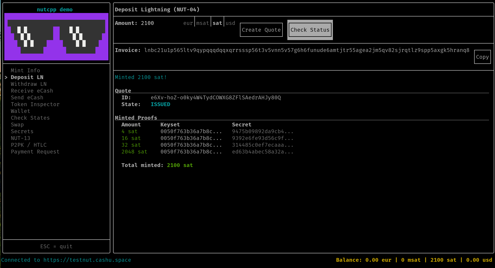
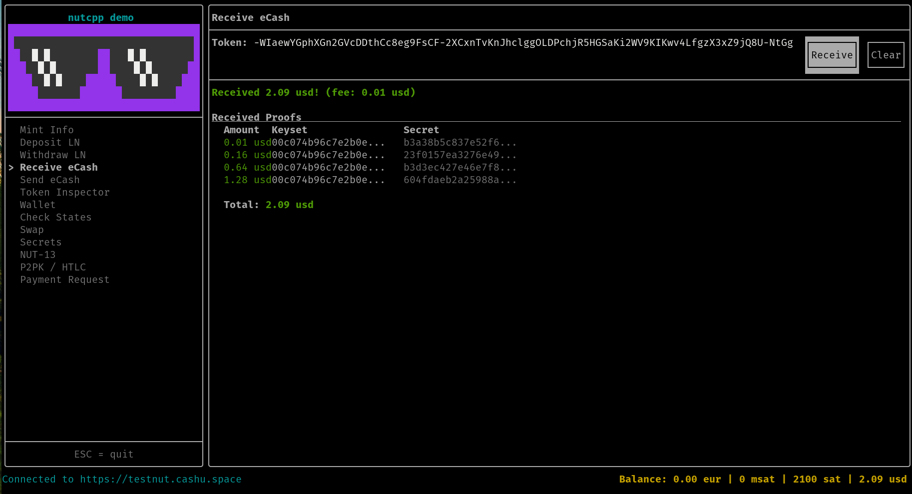
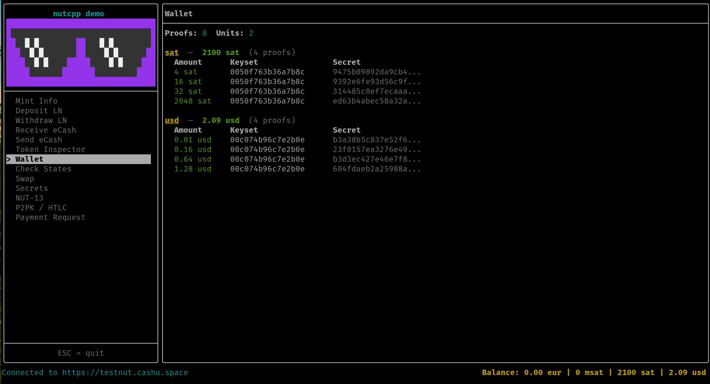
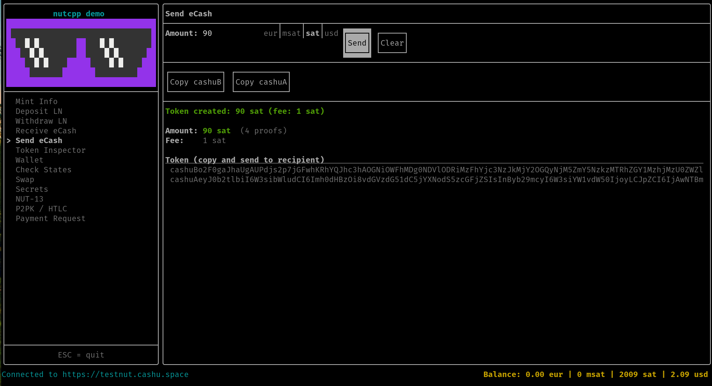

# nutcpp

A C++17 library implementing the [Cashu](https://cashu.space) protocol — privacy-preserving electronic cash built on Bitcoin.

[](https://opensource.org/licenses/MIT)
[](https://isocpp.org/std/the-standard)
[](https://deepwiki.com/Forte11Cuba/nutcpp)

## What is Cashu?

Cashu is an open ecash protocol based on Chaumian blind signatures. A mint issues ecash tokens in exchange for Lightning Network payments. Tokens can be transferred peer-to-peer and redeemed at the mint, with the mint unable to link issuance to redemption. The protocol is defined as a set of numbered specifications called [NUTs](https://github.com/cashubtc/nuts) (Notation, Usage, and Terminology).

nutcpp provides a complete client-side implementation: cryptographic primitives, token encoding, HTTP mint communication, wallet operations, spending conditions, and deterministic secret derivation.

## Quick Start

### Build

```bash
cmake -B build
cmake --build build
```

### Connect to a Mint

```cpp
#include "nutcpp/api/cashu_http_client.h"
#include "nutcpp/api_models/info_response.h"

nutcpp::api::CashuHttpClient client("https://testnut.cashu.space");

auto info = client.get_info();
// info.name, info.version, info.description

auto keys = client.get_keys();
// keys.keysets[0].id, keys.keysets[0].unit, keys.keysets[0].keys
```

### Mint Tokens via Lightning

```cpp
#include "nutcpp/api_models/mint_models.h"
#include "nutcpp/wallet/blinding_helper.h"

using namespace nutcpp;
using namespace nutcpp::wallet;
using namespace nutcpp::api;

// 1. Request a Lightning invoice
PostMintQuoteBolt11Request quote_req(100, "sat");
auto quote = client.create_mint_quote<
    PostMintQuoteBolt11Request,
    PostMintQuoteBolt11Response>("bolt11", quote_req);
// quote.request -> Lightning invoice to pay externally

// 2. Create blinded outputs
auto amounts = split_amount(100);              // {4, 32, 64}
auto outputs = create_blinded_outputs(amounts, keyset_id);

// 3. Mint after payment
PostMintRequest mint_req(quote.quote, outputs.blinded_messages);
auto mint_resp = client.mint<PostMintRequest, PostMintResponse>(
    "bolt11", mint_req);

// 4. Unblind signatures -> spendable proofs
auto proofs = unblind_signatures(
    mint_resp.signatures, outputs.blinding_data, keyset);
```

### Encode and Decode Tokens

```cpp
#include "nutcpp/encoding/token_helper.h"
#include "nutcpp/types/cashu_token.h"

// Encode proofs as a shareable token string
Token tok("https://testnut.cashu.space", proofs);
CashuToken cashu_token({tok}, "sat", std::nullopt);

std::string v3 = encoding::TokenHelper::encode(cashu_token, "A"); // cashuA...
std::string v4 = encoding::TokenHelper::encode(cashu_token, "B"); // cashuB...

// Decode a received token
std::string version;
auto decoded = encoding::TokenHelper::decode(token_string, version);
// decoded.tokens[0].mint, decoded.tokens[0].proofs, decoded.unit
```

## Wallet Helpers

nutcpp provides high-level wallet helpers that reduce the 6-step BDHKE protocol to 3 function calls. These are library functions (not demo-only) and have no HTTP coupling — the caller controls all API calls.

```cpp
#include "nutcpp/wallet/blinding_helper.h"

// Split amount into power-of-2 denominations
auto amounts = nutcpp::wallet::split_amount(100); // {4, 32, 64}

// Generate secrets + blinding factors, compute B_ = Y + rG
auto outputs = nutcpp::wallet::create_blinded_outputs(amounts, keyset_id);
// outputs.blinded_messages -> send to mint
// outputs.blinding_data   -> keep locally

// After mint responds: unblind C_ to get spendable proofs
auto proofs = nutcpp::wallet::unblind_signatures(
    signatures, outputs.blinding_data, keyset);
```

A deterministic overload accepts pre-derived secrets and blinding factors from NUT-13:

```cpp
auto outputs = nutcpp::wallet::create_blinded_outputs(
    amounts, keyset_id, nut13_secrets, nut13_blinding_factors);
```

## Spending Conditions

### P2PK (Pay-to-Public-Key) — NUT-11

```cpp
#include "nutcpp/nuts/p2pk.h"

// Lock a proof to a public key (or multisig n-of-m)
nutcpp::P2PKBuilder builder;
builder.pubkeys = {pubkey1, pubkey2};
builder.signature_threshold = 1; // 1-of-2
builder.sig_flag = "SIG_INPUTS";
auto ps = builder.build();

// Sign to spend
auto witness = ps.generate_witness(secret_bytes, {privkey1});

// Verify
bool valid = ps.verify_witness(secret, witness);
```

### HTLC (Hash Time-Locked Contracts) — NUT-14

```cpp
#include "nutcpp/nuts/htlc.h"

// Lock with a hashlock + authorized pubkeys
nutcpp::HTLCBuilder builder;
builder.hashlock = sha256_hex;
builder.pubkeys = {pubkey};
auto ps = builder.build();

// Spend with preimage + signature
auto witness = ps.generate_witness(msg, {privkey}, preimage_hex);
```

### Deterministic Secrets — NUT-13

```cpp
#include "nutcpp/nuts/nut13.h"

// Derive secrets from a BIP-39 mnemonic
auto seed = nutcpp::internal::mnemonic_to_seed(
    "half depart obvious quality work element tank gorilla view sugar picture humble");

auto secret = nutcpp::derive_secret(seed, keyset_id, counter);
auto r = nutcpp::derive_blinding_factor(seed, keyset_id, counter);
```

Supports both v0 (BIP-32 path derivation) and v1 (HMAC-SHA256 KDF), dispatched automatically by keyset version.

### Payment Requests — NUT-18/26

```cpp
#include "nutcpp/payment/payment_request_encoder.h"

// Decode any payment request (creqA or creqB)
auto pr = nutcpp::payment::PaymentRequestEncoder::parse(creq_string);
// pr.amount, pr.unit, pr.mints, pr.transports, pr.nut10

// Encode
std::string creqA = nutcpp::payment::PaymentRequestEncoder::encode(request);
std::string creqB = nutcpp::payment::PaymentRequestBech32Encoder::encode(request);
```

## Fee-Aware Proof Selection

```cpp
#include "nutcpp/wallet/proof_selector.h"
#include "nutcpp/wallet/fee_helper.h"

// Compute swap fee: ceil(sum_ppk / 1000)
uint64_t fee = nutcpp::wallet::compute_fee(proofs, keyset_fees);

// Select optimal proofs using RGLI algorithm
nutcpp::wallet::ProofSelector selector(keyset_fees);
auto result = selector.select_proofs_to_send(proofs, amount, true);
// result.send -> proofs to spend
// result.keep -> proofs to retain in wallet
```

## Error Handling

```cpp
try {
    auto response = client.swap(swap_request);
}
catch (nutcpp::api::CashuProtocolException& ex) {
    // Mint protocol error (HTTP 400)
    std::cerr << "Mint error: " << ex.error().detail << "\n";
    std::cerr << "Code: " << ex.error().code << "\n";
}
catch (std::runtime_error& ex) {
    // Network failure, JSON parse error, etc.
    std::cerr << "Error: " << ex.what() << "\n";
}
```

## Demo Application

nutcpp includes an interactive terminal demo built with [FTXUI](https://github.com/ArthurSonzogni/FTXUI). It serves as both a functional demo and a reference integration of the library.

```bash
./build/demo/nutcpp_demo
```

### Mint Info — NUT-06

Connect to a mint and inspect its capabilities, supported NUTs, and active keysets.



### Deposit LN — NUT-04

Request a Lightning invoice, pay it externally, and mint ecash proofs.



### Receive eCash — NUT-03

Paste a cashuA/cashuB token and swap it for fresh proofs. Multi-currency aware.



### Wallet

View all proofs grouped by currency with per-unit balances.



### Send eCash

Select an amount, swap for exact change, and get a shareable cashuA/cashuB token.



## Implemented Specifications

| NUT | Description | Status |
|-----|-------------|--------|
| [00](https://github.com/cashubtc/nuts/blob/main/00.md) | Cryptographic primitives, token V3/V4 | Complete |
| [01](https://github.com/cashubtc/nuts/blob/main/01.md) | Mint public key exchange | Complete |
| [02](https://github.com/cashubtc/nuts/blob/main/02.md) | Keysets and keyset IDs | Complete |
| [03](https://github.com/cashubtc/nuts/blob/main/03.md) | Swap tokens | Complete |
| [04](https://github.com/cashubtc/nuts/blob/main/04.md) | Mint tokens (Lightning) | Complete |
| [05](https://github.com/cashubtc/nuts/blob/main/05.md) | Melt tokens (Lightning) | Complete |
| [06](https://github.com/cashubtc/nuts/blob/main/06.md) | Mint information | Complete |
| [07](https://github.com/cashubtc/nuts/blob/main/07.md) | Token state check | Complete |
| [08](https://github.com/cashubtc/nuts/blob/main/08.md) | Lightning fee return | Complete |
| [09](https://github.com/cashubtc/nuts/blob/main/09.md) | Restore signatures | Complete |
| [10](https://github.com/cashubtc/nuts/blob/main/10.md) | Spending conditions | Complete |
| [11](https://github.com/cashubtc/nuts/blob/main/11.md) | Pay-to-Public-Key (P2PK) | Complete |
| [12](https://github.com/cashubtc/nuts/blob/main/12.md) | DLEQ proofs | Complete |
| [13](https://github.com/cashubtc/nuts/blob/main/13.md) | Deterministic secrets (BIP-39/32) | Complete |
| [14](https://github.com/cashubtc/nuts/blob/main/14.md) | Hash Time-Locked Contracts | Complete |
| [18](https://github.com/cashubtc/nuts/blob/main/18.md) | Payment requests (CBOR) | Complete |
| [26](https://github.com/cashubtc/nuts/blob/main/26.md) | Payment requests (Bech32m) | Complete |
| [28](https://github.com/cashubtc/nuts/blob/main/28.md) | Pay-to-Blinded-Key (P2BK) | Complete |

## Project Structure

```text
nutcpp/
├── include/nutcpp/           # Public headers
│   ├── types/                # PubKey, PrivKey, Proof, Token, Keyset, etc.
│   ├── crypto/               # Hash-to-curve, BDHKE, DLEQ
│   ├── encoding/             # Token V3/V4, Base64Url, hex utils
│   ├── api/                  # ICashuApi, CashuHttpClient, CashuError
│   ├── api_models/           # Request/response DTOs (NUT-01 to NUT-09)
│   ├── wallet/               # Blinding helpers, proof selector, fee calc
│   ├── nuts/                 # NUT-10/11/13/14/28, SigAll, P2BK
│   └── payment/              # Payment requests (NUT-18/26)
├── src/                      # Implementations (.cpp)
├── demo/                     # Interactive TUI demo (FTXUI)
└── tests/                    # 14 test files, 296+ tests (Catch2)
```

## Dependencies

All dependencies are fetched automatically via CMake FetchContent.

| Library | Version | Scope | Purpose |
|---------|---------|-------|---------|
| [libsecp256k1](https://github.com/bitcoin-core/secp256k1) | v0.6.0 | Library | Elliptic curve, Schnorr, ECDH |
| [nlohmann/json](https://github.com/nlohmann/json) | v3.11.3 | Library | JSON + CBOR serialization |
| [cpp-httplib](https://github.com/yhirose/cpp-httplib) | v0.18.3 | Library | HTTPS client (header-only) |
| OpenSSL | system | Library | TLS, SHA-256/512, PBKDF2, HMAC |
| [Catch2](https://github.com/catchorg/Catch2) | v3.7.1 | Tests | Unit test framework |
| [FTXUI](https://github.com/ArthurSonzogni/FTXUI) | v5.0.0 | Demo | Terminal UI framework |

## Requirements

- CMake >= 3.20
- C++17-capable compiler
- OpenSSL development headers (`libssl-dev` on Debian/Ubuntu)
- Internet access during first build (for FetchContent)

## Build

```bash
cmake -B build -DCMAKE_BUILD_TYPE=Release
cmake --build build
```

This produces three targets:

| Target | Path | Description |
|--------|------|-------------|
| `nutcpp` | `build/src/libnutcpp.a` | Static library |
| `nutcpp_tests` | `build/tests/nutcpp_tests` | Test runner |
| `nutcpp_demo` | `build/demo/nutcpp_demo` | Interactive demo |

## Testing

```bash
# Run all unit tests
ctest --test-dir build

# Run tests by tag
./build/tests/nutcpp_tests "[types]"
./build/tests/nutcpp_tests "[crypto]"
./build/tests/nutcpp_tests "[encoding]"
./build/tests/nutcpp_tests "[wallet]"
./build/tests/nutcpp_tests "[p2pk]"
./build/tests/nutcpp_tests "[nut13]"
./build/tests/nutcpp_tests "[payment]"

# Run integration tests (requires internet)
./build/tests/nutcpp_tests "[integration]"

# Run everything except integration
./build/tests/nutcpp_tests "~[integration]"
```

Test vectors are cross-validated against [DotNut](https://github.com/Kukks/DotNut) (C# reference implementation) for interoperability.

## Reference

- [Cashu Protocol Specifications (NUTs)](https://github.com/cashubtc/nuts) — source of truth
- [DotNut](https://github.com/Kukks/DotNut) — architectural reference (C#)
- [Cashu.space](https://cashu.space) — official project site

## License

MIT
